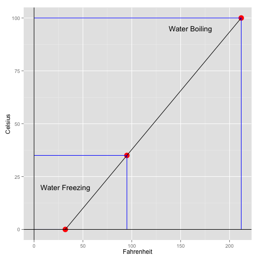

## Fahrenheit to Celsius Converter

---

## For what is it used?

This is a simple Shiny App that can be used to convert temperatures in Fahrenheit to Celsius.


---
## The Relationship Between Fahrenheit and Celsius
 

---

## ui.R


```r
library(shiny)
library(shinythemes)

shinyUI(fluidPage(theme=shinytheme('flatly'),
    pageWithSidebar(
    headerPanel("Convert from Fahrenheit to Celsius"),

  # Sidebar with input  
    sidebarPanel(
        helpText("Input temperature in Fahrenheit and click Submit."),
      numericInput('fahrenheit', "Temperature in Fahrenheit", 0, min=0, step=1),
      submitButton("Submit")),

    # Show the Data Entered and the Calculation
    mainPanel(
        h4("You entered:"),
        verbatimTextOutput('fahrenheit'),
        h4("Which in Celsius is:"),
        verbatimTextOutput('celsius')))))
```

---

## server.R

```r
library(shiny)
library(shinythemes)

#function to convert fahrenheit to celsius
fahToCel<-  function(fahrenheit) ((fahrenheit-32)*(5/9))

shinyServer(function(input, output) {
    output$fahrenheit <- renderPrint({input$fahrenheit})
    output$celsius  <- renderPrint({fahToCel(input$fahrenheit)})})
```


